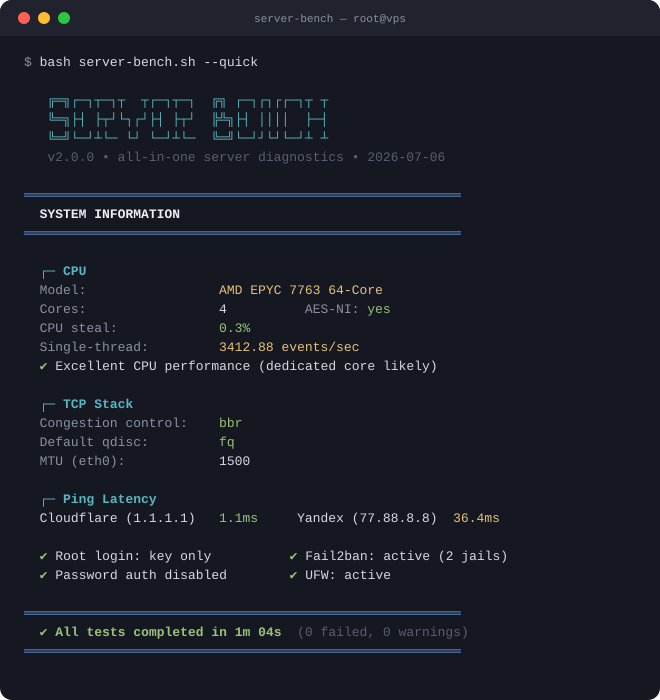

<h1 align="center">🚀 Server Bench</h1>

<p align="center">
  <b>Вся диагностика и бенчмарки сервера одной командой</b><br>
  <sub>Одна команда. Красивый вывод. Всё, что нужно, чтобы проверить VPS.</sub>
</p>

<p align="center">
  <a href="README.md">🇬🇧 English version</a>
</p>

<p align="center">
  
  
  
  
  
</p>

<p align="center">
  
</p>

## ⚡ Быстрый старт

Запуск на Linux-сервере:

```bash
bash <(curl -fsSL https://raw.githubusercontent.com/jestivald/server-bench/main/server-bench.sh)
```

Интерактивный выбор тестов: номера и диапазоны, оценка времени, нужные инструменты:

```bash
bash <(curl -fsSL https://raw.githubusercontent.com/jestivald/server-bench/main/server-bench.sh) --menu
```

Быстрая проверка (система + сеть + безопасность + docker, ~1 мин):

```bash
bash <(curl -fsSL https://raw.githubusercontent.com/jestivald/server-bench/main/server-bench.sh) --quick
```

Сохранить результаты в файл:

```bash
bash <(curl -fsSL https://raw.githubusercontent.com/jestivald/server-bench/main/server-bench.sh) --quick 2>&1 | tee bench-results.txt
```

> Зависимости (sysbench, fio, dnsutils, iperf3, jq) ставятся автоматически — но только те,
> что реально нужны выбранным модулям. Флаг `--no-install` запрещает любую
> установку пакетов; внешние скрипты в этом режиме пропускаются.

**Режим отчёта (v2.1):** если модулей больше одного и запуск идёт в терминале,
тесты выполняются тихо за прогресс-чеклистом (`[████░░░░] 44% ► speed-ru 2m 14s`),
а по завершении печатается **структурированный итог** — больше никаких простыней
текста, улетающих мимо глаз. Полный текстовый отчёт заодно автоматически
сохраняется в `./server-bench-<время>.log.<случайный-суффикс>`. Хочешь старый живой вывод — добавь
`--live`. Файлы доступны только владельцу (права `600`), параллельные запуски
не перезаписывают отчёты друг друга.

## 🧪 Что проверяется

| Модуль | Флаг | Что делает | Время |
|:---|:---|:---|:---|
| 📋 Система | `--info` | ОС, CPU (модель/steal%/AES-NI), виртуализация, RAM, диски, IP, гео, rDNS, sysbench CPU (1 + N потоков) | ~30с |
| 💾 Диск | `--disk` | fio: последовательные 1M чтение/запись + случайные 4K IOPS, direct I/O на реальном (не tmpfs) пути; фолбэк dd | ~1мин |
| 🌐 Сеть | `--network` | TCP-стек (BBR? qdisc? MTU), исходящий 25-й порт, параллельные проверки ping с потерями и DNS | ~15с |
| 🔒 Безопасность | `--security` | Эффективный конфиг sshd (`sshd -T` с drop-in'ами), фаервол (ufw/nft/iptables), fail2ban, обновления | ~10с |
| 🐳 Docker | `--docker` | Статус контейнеров, количество, занятое место | ~5с |
| 🔍 Проверка IP | `--ip` | Репутация IP ([IP.Check.Place](https://ip.check.place)) + определение региона ([ipregion](https://github.com/vernette/ipregion)) | ~3мин |
| 🇷🇺 Скорость РФ | `--speed-ru` | Встроенный iPerf3 до пяти городов РФ: отдельные upload и обратный download, 4 потока, по 5с | ~2мин |
| 🌍 Скорость мир | `--speed-int` | Замер скорости до зарубежных провайдеров (bench.sh / speed.tlab.pw) | ~5мин |
| 🌍 Геоблокировки | `--geoblock` | Доступ к сервисам по региону ([censorcheck](https://github.com/vernette/censorcheck), `--mode geoblock`) | ~2мин |
| 📸 Instagram | `--instagram` | Проверка блокировки аудио в Instagram (bench.openode.xyz) | ~30с |
| 🛡️ DPI | `--dpi` | Проверка DPI-блокировок для российских серверов ([censorcheck](https://github.com/vernette/censorcheck)) | ~1мин |
| 📊 YABS | `--yabs` | Классический [yabs.sh](https://github.com/masonr/yet-another-bench-script): fio + iperf3 + Geekbench 6 | ~20мин |

`--all` (по умолчанию) запускает всё, кроме `--geoblock`, `--instagram`, `--dpi` и `--yabs` — они включаются отдельно.

## 🎯 Использование

```bash
# полный набор тестов
bash <(curl -fsSL https://raw.githubusercontent.com/jestivald/server-bench/main/server-bench.sh) --all

# быстрая проверка здоровья сервера
bash <(curl -fsSL https://raw.githubusercontent.com/jestivald/server-bench/main/server-bench.sh) --quick

# выбери нужное (флаги комбинируются)
bash <(curl -fsSL https://raw.githubusercontent.com/jestivald/server-bench/main/server-bench.sh) --info --disk --network

# машиночитаемо: JSON в stdout, человеческий отчёт в stderr
bash <(curl -fsSL https://raw.githubusercontent.com/jestivald/server-bench/main/server-bench.sh) --json --quick 2>/dev/null

# замаскировать IP сервера (a.b.x.x), скрыть hostname и rDNS
bash <(curl -fsSL https://raw.githubusercontent.com/jestivald/server-bench/main/server-bench.sh) --quick --hide-ip
```

### Опции

| Флаг | Эффект |
|:---|:---|
| `--menu` | Выбор модулей; Enter запускает выбранное, `q` отменяет |
| `--list` | Список модулей, оценок времени и инструментов без запуска проверок |
| `--report` | Прогресс-чеклист + структурированный итог + автосохранение в файл (по умолчанию при нескольких модулях в терминале) |
| `--live` | Живой вывод тестов по мере выполнения (по умолчанию для одного модуля) |
| `--json` | JSON в stdout для встроенных модулей, включая `--speed-ru`; отчёт — в stderr |
| `--hide-ip` | Маскирует определённые IP сервера, скрывает hostname/rDNS; внешние скрипты пропускаются |
| `--no-install` | Запрещает установку пакетов; отсутствующие инструменты и внешние скрипты пропускаются |
| `--no-color` | Без цветов (переменная окружения `NO_COLOR` тоже работает) |
| `--version` / `--help` | Ну ты понял |

Если указаны только флаги вывода/настроек, применяется обычный набор `--all`.
Для короткого запуска добавь `--quick`. Флаги `--ip-check` и `--ip-region`
выбирают две части `--ip` отдельно. Меню требует терминала и несовместимо с `--json`.

### Пример JSON-вывода

```json
{"version":"2.3.0","os":"Debian GNU/Linux 12 (bookworm)","virt":"kvm",
 "cpu_cores":4,"cpu_eps_1t":2847.31,"cpu_steal_pct":0.3,
 "disk_seq_write_mbs":412.7,"disk_rand_read_iops":48210,
 "tcp_cc":"bbr","qdisc":"fq","ping_yandex_avg_ms":38.2,
 "ssh_password_auth":"no","fail2ban":"yes",
 "module_security_status":"warning","module_security_elapsed_s":2,
 "fails":0,"warns":1,"skips":0}
```

Статусы модулей: `ok`, `warning`, `failed`, `skipped`. Неизмеренные числовые
значения записываются как `null`. Скорость РФ — в Mbps, например
`speed_ru_moscow_upload_mbps` и `speed_ru_moscow_download_mbps`.
Существующие дисковые поля `_mbs` содержат MiB/s (KiB/s fio, делённые на 1024).
Завершённая диагностика возвращает код `0`, даже если есть замечания; в автоматизации
проверяй `fails`, `warns` и статусы модулей. Ошибки CLI/подготовки возвращают ненулевой код.

## 📋 Требования

- Linux (Debian, Ubuntu, CentOS, Fedora, AlmaLinux, Rocky)
- bash 4+, GNU coreutils (`timeout`), curl для IP/внешних проверок
- root **или** sudo желательно (автоустановка + привилегированные проверки);
  работает и без прав — часть проверок пропускается

CI запускает регрессионные тесты на Ubuntu 22.04 и 24.04. В pull request и при
пуше в main дополнительно проверяются весь локальный набор, реальные показатели
fio/CPU, iPerf3 через loopback и остановка дочерних процессов по таймауту.
Подробнее — в [заметках об обновлении](docs/V2.3-NOTES.md).

## 🔗 Под капотом

Тяжёлую работу во внешних модулях делают известные комьюнити-скрипты,
выполняются на лету (с таймаутами):

| Проверка | Апстрим |
|:---|:---|
| Репутация IP | [IP.Check.Place](https://ip.check.place) |
| Регион IP | [vernette/ipregion](https://github.com/vernette/ipregion) |
| DPI / геоблокировки | [vernette/censorcheck](https://github.com/vernette/censorcheck) |
| Скорость мир | [bench.sh](https://bench.sh) (teddysun), speed.tlab.pw |
| Instagram аудио | bench.openode.xyz |
| YABS | [masonr/yet-another-bench-script](https://github.com/masonr/yet-another-bench-script) |

Встроенные модули (info/disk/network/security/docker/speed-ru) используют
установленные `sysbench`, `fio`, `dd`, `ping`, `dig`, `iperf3`, `jq` напрямую.
Адреса RU-серверов взяты из [itdoginfo/russian-iperf3-servers](https://github.com/itdoginfo/russian-iperf3-servers).
Идеи меню и отдельного геоблока — из [saveksme/multitest](https://github.com/saveksme/multitest);
реализация написана независимо. Собственный отчёт Server Bench сохраняется локально.

> Внешние модули скачивают и выполняют актуальные сторонние скрипты.
> [Прежний аудит](docs/UPSTREAM-AUDIT.md) описывает июльский снимок, а не последующие
> изменения апстримов. `--json`, `--no-install` и `--hide-ip` пропускают эти скрипты.
> У IP.Check.Place сохранён флаг приватности `-p`; опциональный YABS может публиковать результаты Geekbench.

## 📝 Изменения

**v2.3** — 2026-09-06
- `--menu` / `--list`: выбор проверок, оценка времени и нужные инструменты.
- `--geoblock`: отдельная проверка геоблокировок через censorcheck.
- Встроенный `--speed-ru`: отдельные upload/download (`iperf3 -R`), ограниченные повторы портов, метрики в JSON.
- Ping, DNS и IPv4/IPv6 проверяются параллельно; зависимости ставятся одной пачкой, apt обновляет список один раз.
- Проверяется ошибка fio, случайные тесты действительно идут 10 секунд; поиск диска пропускает заполненные/неопределённые файловые системы.
- Исправлены UFW `inactive`, недостоверные SSH-настройки, вывод об обновлениях и Docker-строки без портов.
- Корректное экранирование JSON, статусы/время модулей, приватные уникальные отчёты и таймауты дочерних процессов.
- `--no-install` / `--hide-ip` пропускают внешние скрипты; флаги вывода без модулей запускают обычный набор.

**v2.2** — 2026-07-06
- Внешним скриптам **автоматически отвечается «y»** — больше никаких зависаний и мгновенных смертей на вопросах «continue? [y/n]» (установки зависимостей подтверждаются за тебя)
- Если апстрим отдаёт HTML-страницу вместо скрипта или скрипт умирает сразу после старта — **автоматический переход на зеркало** (корень bench.gig.ovh стал HTML-страницей — RU-спидтест теперь первым делом гоняет bench.tlab.pw)
- **⚡ Scorecard**: структурированный отчёт открывается сводкой на один экран — CPU/RAM/диск/сеть/IP/безопасность одним взглядом
- IP.Check.Place вызывается с **`-p` (privacy)**: твой отчёт больше не заливается на upload.check.place с публичной ссылкой (+`-y` для зависимостей)
- Спиннеры захваченных скриптов больше не заливают отчёт и сохранённый лог (честная эмуляция `\r`)
- Таблица дисков очищена от tmpfs/docker-overlay мусора; статус Docker-контейнера не режется посреди слова; DNS показывает `<1ms` вместо `0ms`
- **Аудит безопасности всех внешних скриптов** — [docs/UPSTREAM-AUDIT.md](docs/UPSTREAM-AUDIT.md)

**v2.1** — 2026-07-06
- **Режим отчёта**: при нескольких модулях вместо бегущего текста — прогресс-чеклист с процентовкой, а в конце структурированный итог (локальные модули целиком, спидтесты сжаты до таблиц результатов, IP-чек — до ключевых строк)
- Полный текстовый отчёт **автосохраняется** в `./server-bench-<время>.log` (без ANSI-кодов)
- `--live` — старый живой вывод, `--report` — форсировать режим отчёта для одного модуля

**v2.0** — 2026-07-06
- Больше не умирает на середине: убран хрупкий `set -e`, каждая проверка деградирует без падения; в итогах — счётчики fail/warn и время каждого модуля
- Работает под голым root без установленного `sudo` (типичный VPS); никогда не спрашивает пароль в неинтерактивном запуске
- Честный диск-бенч: fio с direct I/O на реальной (не tmpfs) файловой системе, проверка свободного места, dd как фолбэк
- Зависимости ставятся лениво — только под выбранные модули; `--help` больше не трогает apt 🙃
- Новое: `--yabs`, `--json`, `--hide-ip`, `--no-install`, `--no-color`, `--version`
- Новые проверки: CPU steal%, тип виртуализации, AES-NI, многопоточный sysbench, BBR/qdisc/MTU, исходящий 25-й порт, потери пакетов, rDNS, эффективный конфиг sshd (включая drop-in'ы), nftables
- Внешние скрипты — с таймаутами, stderr больше не глушится; правильные имена пакетов для yum/dnf; CI: shellcheck + smoke-тест на реальном раннере

<details>
<summary><b>v1.0</b></summary>

- Первый релиз: инфо о системе, dd-тест диска, ping/DNS, аудит SSH/фаервола, статус docker, обёртки для IP.Check.Place / ipregion / bench.sh / bench.gig.ovh / censorcheck / Instagram-чекера
</details>

## 📄 Лицензия

MIT
